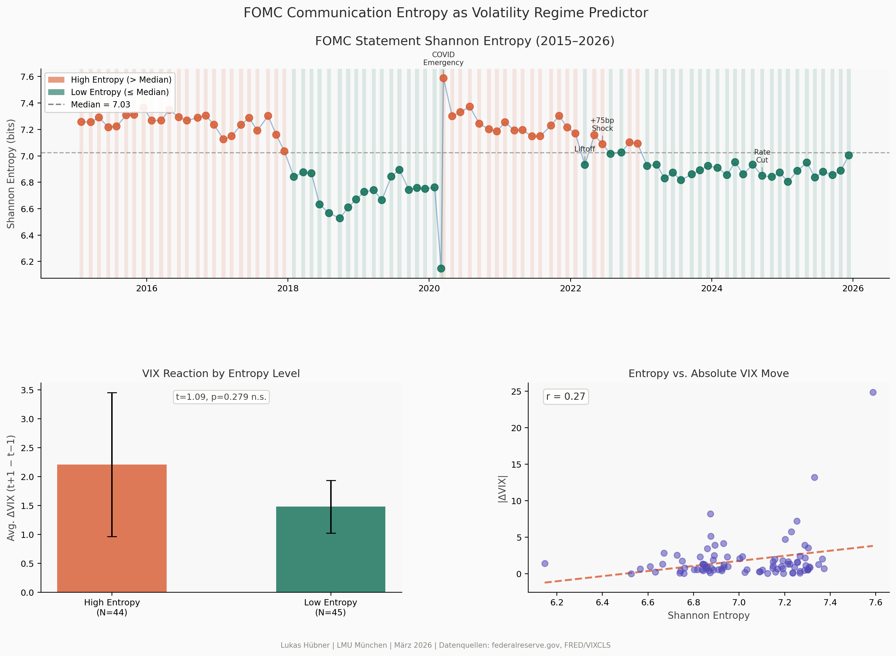

<div align="center">


# fomc-entropy-vix

Empirical macro-finance research project studying whether FOMC communication complexity predicts post-meeting market volatility (VIX), 2015–2026.

## Main Findings

I find a positive relationship between FOMC statement entropy and subsequent VIX moves.

In a sample of 89 meetings (2015–2026), higher-entropy statements are associated with larger absolute next-day changes in the VIX (OLS: β = +2.03, p = 0.080). A Frisch-Waugh-Lovell residualization gives a similar result (r = 0.19, p = 0.077), while the size of the rate move itself is not significant in this specification (p = 0.31).

I treat this as suggestive rather than conclusive evidence: the effect is economically interesting, but the sample is still small and the significance is at the 10% level.

[](charts/fomc_entropy_chart.png)

## Research Question

Does the way the Fed writes its statements predict how much markets move?

## What I Did

I scraped 89 FOMC press statements (2015–2026) from federalreserve.gov, computed Shannon entropy for each statement, and matched the results to VIX reactions around meeting dates.

The baseline analysis controls for the size of the rate move, so the goal is to separate the "what they decided" effect from the "how they communicated" effect.

*Lukas Hübner | LMU München | BSc Statistics & Data Science + Business Psychology*
</div>

## Repository layout

```
fomc-entropy-vix/
├── analysis/
│   ├── entropy_calculation.py        # Shannon entropy & Loughran-McDonald uncertainty index
│   ├── iv_estimation.py              # 2SLS / IV estimation (entropy → VIX)
│   └── event_study.py               # Abnormal VIX change around FOMC meeting dates
├── charts/
│   └── fomc_entropy_chart.png
├── data/
│   ├── fetch_fomc_statements.py      # Scrape FOMC press statements from federalreserve.gov
│   ├── fetch_fed_funds_futures.py    # Download Fed Funds rate / futures data from FRED
│   └── fetch_vix.py 
├── notebooks/
│   └── fomc_entropy_vs_vix.ipynb    # Charts: entropy vs VIX
├── tests/
│   ├── test_entropy_calculation.py
│   ├── test_event_study.py
│   └── test_iv_estimation.py
├── README.md
└── requirements.txt
```

## Quick start

```bash
# 1. Install dependencies
pip install -r requirements.txt

# 2. Fetch data  (FRED API key required for fed-funds and VIX-FRED sources)
python data/fetch_fomc_statements.py --output data/fomc_statements.csv
python data/fetch_vix.py --source yahoo --output data/vix.csv
python data/fetch_fed_funds_futures.py \
    --api-key <YOUR_FRED_KEY> \
    --fomc-dates data/fomc_statements.csv \
    --output data/fed_funds_surprises.csv

# 3. Run analysis
python analysis/entropy_calculation.py
python analysis/event_study.py
python analysis/iv_estimation.py

# 4. Open the notebook
jupyter notebook notebooks/fomc_entropy_vs_vix.ipynb
```

## Running tests

```bash
pytest tests/
```

## Data sources

| Data | Source | Script |
|------|--------|--------|
| FOMC press statements | federalreserve.gov | `data/fetch_fomc_statements.py` |
| CBOE VIX | Yahoo Finance (`^VIX`) / FRED `VIXCLS` | `data/fetch_vix.py` |
| Fed Funds rate | FRED (series `FF`) | `data/fetch_fed_funds_futures.py` |

## Methodology

1. **Entropy** – Shannon entropy of the unigram token distribution in each FOMC post-meeting press statement. 
    Higher entropy means a more dispersed vocabulary and a less concentrated textual signal.
2. **Baseline regression** – Entropy is related to next-day absolute VIX changes,
    controlling for the size of the rate move and prior market conditions.
3. **Event-study perspective** – I examine abnormal VIX changes around FOMC meeting dates using a short post-meeting window.

## Extensions

Exploratory IV / 2SLS code is included in analysis/iv_estimation.py, but I treat it as an extension rather than the main identification claim.

## Limitations

The sample is relatively small (N = 89), so statistical power is limited.
The main results are significant at the 10% level, not the 5% level.
A cleaner high-frequency policy surprise measure would improve identification.
Extending the sample further back in time would make the analysis more informative.

## Further planned actions

extend the sample further back in time
replace the simple policy-rate proxy with a cleaner surprise measure
test richer NLP measures beyond unigram entropy
compare results across hike / hold / cut regimes
